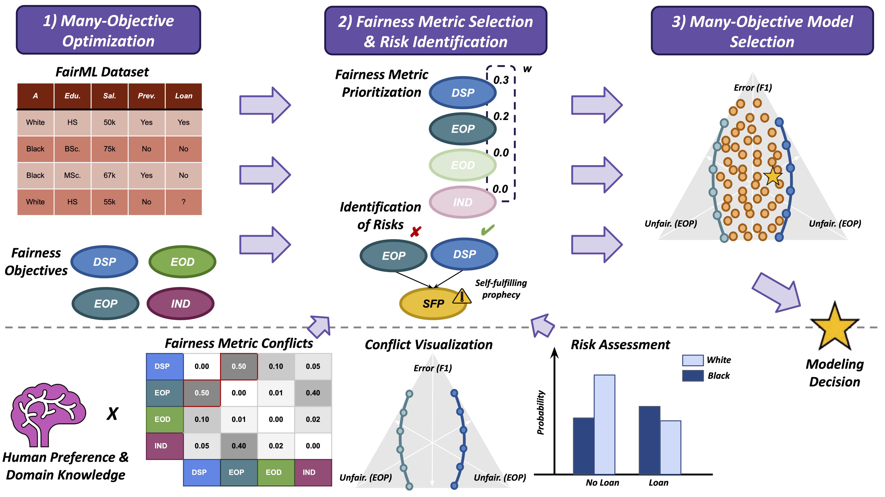

# ManyFairHPO: Many-Objective Fairness-Aware Hyperparameter Optimization

In this repository you will find all source code for experiments and analyses accompanying the submission "A Human-in-the-Loop Fairness-Aware Model Selection Framework for Complex Fairness Objective Landscapes" to the ACM/AAAI AIES '24 Conference.

<center>
  
</center>

## Getting Started

### Install dependencies

#### HPOBench

```
cd HPOBench
pip install -e .
cd ..
```

#### MO-HPOBenchExperimentUtils

```
cd MO-HPOBenchExperimentUtils
pip install -e .
cd ..
```

## Run a ManyFairHPO Experiment

```
python -u runner.py --objective_name f1_multi --model_name rf --dataset_name adult --seed 0 --optimizer_name nsga3
```

## Analyze ManyFairHPO Results

The logs of our experimental results are provided on [Google Drive](https://drive.google.com/file/d/1TcYjjctuSEAHxL_SWopcTJ_IHRNb7tIA/view?usp=sharing). Please download the ```expiriments.pkl``` file and place it in your the main project directory.


```python
import pickle as pkl

with open('experiments.pkl', 'rb') as f:
    experiments = pkl.load(f)
```

```python
[1] experiments[('f1_multi', 'rf', 'adult')]['function_values']

        val_f1  val_ddsp  val_deod  val_deop  val_invd   
0     0.316078  0.081204  0.026665  0.031306  0.019893  
1     0.331510  0.075258  0.023383  0.026932  0.018170 
2     0.323927  0.076689  0.023580  0.027098  0.019064  
3     0.318430  0.081030  0.026330  0.031248  0.020370  
4     0.397887  0.055827  0.007331  0.006138  0.017072  
...        ...       ...       ...       ...       ...   
996   1.000000  0.000000  0.000000  0.000000  0.000000 
997   0.973703  0.001843  0.001118  0.002210  0.000258    
998   0.905509  0.006025  0.003782  0.007564  0.000940   
999   0.405365  0.055905  0.014091  0.017897  0.013220     
1000  0.340335  0.067798  0.017519  0.021524  0.017845

[10010 rows x 10 columns]
```

```python
[2] experiments[('f1_multi', 'rf', 'adult')]['archive']

     max_depth  max_features min_samples_leaf min_samples_split n_estimators
0           28      0.896547               15                78          109
1           22      0.367562               13                57          179
2           49      0.435865                8               102          106
3           29      0.891923               19                11           18
4            2      0.806194               17               100          175
...        ...           ...              ...               ...          ...
996          2      0.004743                3               127          167
997          1      0.580992               14                83          173
998          1      0.643578               16                88          163
999          4      0.544248               10                89          167
1000         9      0.608166                5                69          173

[10010 rows x 5 columns]
```
# ManyFairHPO-AIES
